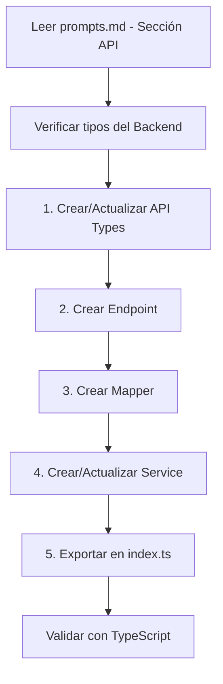
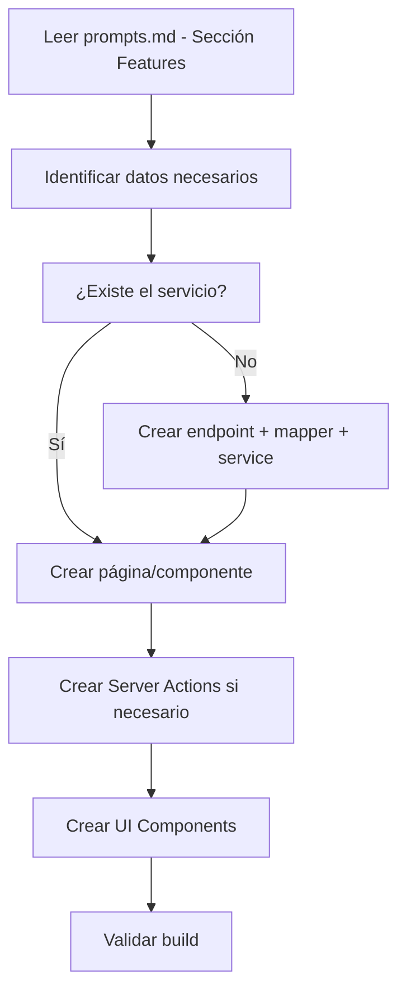
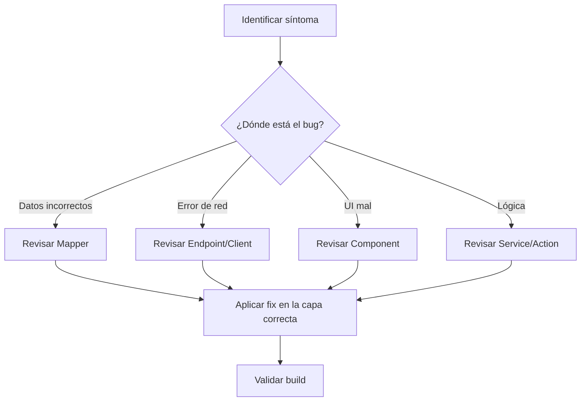

# Grace Hub Frontend - Índice de Documentación

> **Navegación rápida a toda la documentación del proyecto**

---

## 📚 Para Empezar

### Nuevo en el Proyecto

1. **Lee primero**: [README.md](../README.md) - Visión general
2. **Entiende**: [architecture/FRONTEND_ARCHITECTURE.md](architecture/FRONTEND_ARCHITECTURE.md) - Arquitectura
3. **Reglas**: [architecture/ARCHITECTURE_RULES.md](architecture/ARCHITECTURE_RULES.md) - Reglas inquebrantables

### Desarrollador Experimentado

Ir directo a:
- [prompts/prompts.md](prompts/prompts.md) - Para trabajar con IA
- [architecture/ARCHITECTURE_RULES.md](architecture/ARCHITECTURE_RULES.md) - Reglas de referencia rápida

---

## 🗂️ Documentación por Categoría

### 🏗️ Arquitectura

| Documento | Descripción | Para quién |
|-----------|-------------|------------|
| [FRONTEND_ARCHITECTURE.md](architecture/FRONTEND_ARCHITECTURE.md) | Guía completa de la arquitectura implementada | Todos |
| [ARCHITECTURE_RULES.md](architecture/ARCHITECTURE_RULES.md) | Reglas y restricciones por capa | Desarrolladores |

**Cuándo leer**:
- ✅ Antes de crear tu primera feature
- ✅ Cuando tengas dudas sobre dónde poner código
- ✅ Antes de hacer code review

---

### 🤖 Prompts para IA

| Documento | Descripción | Para quién |
|-----------|-------------|------------|
| [prompts.md](prompts/prompts.md) | Prompts completos para Claude, GPT-4, etc. | IAs y Devs |

**Contiene**:
1. Prompt para crear features completas
2. Prompt para crear nuevos endpoints/servicios
3. Prompt para crear componentes UI
4. Prompt para corregir bugs
5. Reglas de arquitectura inviolables
6. Ejemplos completos paso a paso

**Cuándo usar**:
- ✅ Cuando trabajes con un asistente de IA
- ✅ Cuando necesites consumir un nuevo endpoint del backend
- ✅ Cuando no sepas en qué capa poner el código
- ✅ Cuando necesites crear componentes nuevos

---

## 🎯 Flujos de Trabajo

### Crear un Nuevo Endpoint/Consumo de API



**Documentos a consultar**:
1. [prompts.md](prompts/prompts.md) - Sección "Crear Nuevo Endpoint"
2. [ARCHITECTURE_RULES.md](architecture/ARCHITECTURE_RULES.md) - Reglas por capa

---

### Crear una Nueva Feature/Página



---

### Corregir un Bug



---

## 📁 Estructura del Proyecto

```
src/
├── app/                           # Next.js App Router
│   ├── layout.tsx                 # Root layout
│   ├── page.tsx                   # Dashboard (home)
│   ├── actions/                   # Server Actions
│   │   ├── memberActions.ts
│   │   ├── eventActions.ts
│   │   └── groupActions.ts
│   └── [feature]/                 # Feature pages
│       └── page.tsx
│
├── components/                    # React Components
│   ├── ui/                        # Primitivos (shadcn/ui)
│   ├── layout/                    # Layout components
│   └── [feature]/                 # Feature-specific components
│
├── lib/                           # Utilities & Core Logic
│   ├── types.ts                   # Domain types (frontend)
│   ├── utils.ts                   # General utilities
│   └── api/                       # ⭐ API Layer (Backend Communication)
│       ├── client.ts              # HTTP Client
│       ├── types.ts               # API Response Types
│       ├── endpoints/             # Raw API calls
│       ├── mappers/               # API ↔ Frontend translation
│       └── services/              # Orchestration layer
│
└── hooks/                         # Custom React hooks
```

---

## 🔗 Relación Frontend ↔ Backend

```
┌─────────────────────────────────────────────────────────────────┐
│                        FRONTEND (Next.js)                        │
├─────────────────────────────────────────────────────────────────┤
│  Pages/Components                                                │
│       ↓ usa                                                      │
│  Services (src/lib/api/services/)                               │
│       ↓ usa                                                      │
│  Mappers (src/lib/api/mappers/)     ← Traduce API ↔ Frontend    │
│       ↓ usa                                                      │
│  Endpoints (src/lib/api/endpoints/) ← Llamadas HTTP             │
│       ↓ usa                                                      │
│  Client (src/lib/api/client.ts)     ← Fetch + Error Handling    │
└─────────────────────────────────────────────────────────────────┘
                              │
                              ↓ HTTP
┌─────────────────────────────────────────────────────────────────┐
│                    BACKEND (NestJS)                              │
│                  GET /api/v1/members                             │
│                  POST /api/v1/members                            │
│                  etc.                                            │
└─────────────────────────────────────────────────────────────────┘
```

---

## ✅ Checklist de Desarrollo

### Antes de crear código:
- [ ] ¿Leí la documentación de arquitectura?
- [ ] ¿Identificé en qué capa va mi código?
- [ ] ¿El backend tiene el endpoint que necesito?

### Después de crear código:
- [ ] ¿Ejecuté `npm run build` sin errores?
- [ ] ¿Los tipos están correctos (`npx tsc --noEmit`)?
- [ ] ¿Exporté todo en los archivos `index.ts`?
- [ ] ¿Seguí las convenciones de nombres?

---

## 📞 Contacto con Backend

Cuando el frontend necesite un endpoint que no existe:

1. Documenta qué endpoint necesitas
2. Define el contrato esperado (request/response)
3. Crea un issue o comunícate con el equipo backend
4. Mientras tanto, puedes mockear el servicio (ver prompts.md)
